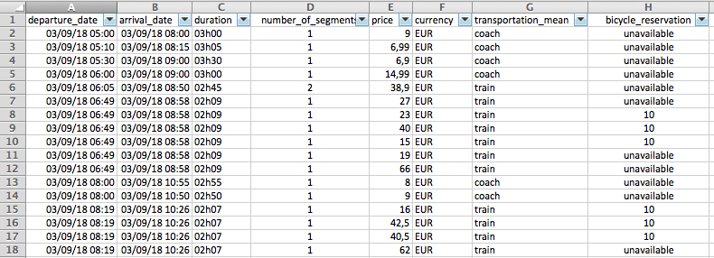

# Trainline

[](https://travis-ci.org/tducret/trainline-python)
[](https://coveralls.io/github/tducret/trainline-python)
[](https://pypi.org/project/trainline/)
[](https://hub.docker.com/r/thibdct/trainline/)


## Description

Non-official Python wrapper and CLI tool for Trainline

I wrote a French blog post about it [here](https://www.tducret.com/scraping/2018/09/05/trouvez-le-billet-de-train-le-moins-cher-grace-a-ce-module-python.html)

🎁 I added [a tiny Docker image](#docker) to use the tool very easily

# Requirements

- Python 3
- pip3

## Installation

```bash
pip3 install -U trainline
```

## CLI tool usage

```bash
trainline_cli.py --help
```

Examples :

```bash
trainline_cli.py --departure="Toulouse" --arrival="Bordeaux" --next=12hours
trainline_cli.py --departure="Paris" --arrival="Marseille" --next=1day
```

or the shorter call :

```bash
trainline_cli.py -d Toulouse -a Bordeaux -n 12h
trainline_cli.py -d Paris -a Marseille -n 1d
```

Example output :

```bash
departure_date;arrival_date;duration;number_of_segments;price;currency;transportation_mean;bicycle_reservation
15/10/2018 08:19;15/10/2018 10:26;02h07;1;36,0;EUR;train;30,0
15/10/2018 08:19;15/10/2018 10:26;02h07;1;37,5;EUR;train;30,0
15/10/2018 08:19;15/10/2018 10:26;02h07;1;95,5;EUR;train;30,0
[...]
```

You can then open it with your favorite spreadsheet editor (and play with the filters) :



## Package usage

```python
# -*- coding: utf-8 -*-
import trainline

results = trainline.search(
	departure_station="Toulouse",
	arrival_station="Bordeaux",
	from_date="15/10/2018 08:00",
	to_date="15/10/2018 21:00")

print(results.csv())
```

Example output :

```bash
departure_date;arrival_date;duration;number_of_segments;price;currency;transportation_mean;bicycle_reservation
15/10/2018 08:00;15/10/2018 10:55;02h55;1;5,0;EUR;coach;unavailable
15/10/2018 08:00;15/10/2018 10:50;02h50;1;4,99;EUR;coach;unavailable
15/10/2018 08:19;15/10/2018 10:26;02h07;1;20,5;EUR;train;10,0
[...]
```

```python
# -*- coding: utf-8 -*-
import trainline

Pierre = trainline.Passenger(birthdate="01/01/1980", cards=[trainline.AVANTAGE_FAMILLE])
Sophie = trainline.Passenger(birthdate="01/02/1981")
Enzo = trainline.Passenger(birthdate="01/03/2012")
Nicolas = trainline.Passenger(birthdate="01/01/1996", cards=[trainline.AVANTAGE_JEUNE])
Nicolas.add_special_card(trainline.TGVMAX, "YourCardNumber")

results = trainline.search(
	passengers=[Pierre, Sophie, Enzo, Nicolas],
	departure_station="Toulouse",
	arrival_station="Bordeaux",
	from_date="15/10/2018 08:00",
	to_date="15/10/2018 21:00",
	bicycle_with_or_without_reservation=True)

print(results.csv())
```

Example output :

```bash
departure_date;arrival_date;duration;number_of_segments;price;currency;transportation_mean;bicycle_reservation
15/10/2018 08:19;15/10/2018 10:26;02h07;1;36,0;EUR;train;30,0
15/10/2018 08:19;15/10/2018 10:26;02h07;1;37,5;EUR;train;30,0
15/10/2018 08:19;15/10/2018 10:26;02h07;1;95,5;EUR;train;30,0
[...]
```

# Docker

You can use the `trainline` tool with the [Docker image](https://hub.docker.com/r/thibdct/trainline/)

You may execute :

`docker run -it --rm thibdct/trainline --departure="Toulouse" --arrival="Bordeaux" --next=12hours`

> The Docker image is built on top of [Google Distroless image](https://github.com/GoogleContainerTools/distroless), so it is tiny :)

## 🤘 The easy way 🤘

I also built a bash wrapper to execute the Docker container easily.

Install it with :

```bash
curl -s https://raw.githubusercontent.com/tducret/trainline-python/master/trainline.sh \
> /usr/local/bin/trainline && chmod +x /usr/local/bin/trainline
```
*You may replace `/usr/local/bin` with another folder that is in your $PATH*

Check that it works :

```bash
trainline --help
trainline --departure="Toulouse" --arrival="Bordeaux" --next=12hours
```

You can upgrade the app with :

```bash
trainline --upgrade
```

and even uninstall with :

```bash
trainline --uninstall
```

# TODO

- [ ] Create a sort function in Folders class (to get the cheapest trips first for example)
- [ ] Add filter for class (first, second), for max_duration
- [X] Implement `get_station_id`
- [X] Implement the use of passengers during search
- [X] Calculate total price with bicycle reservation if search 'with_bicyle' (and export it in csv)
- [X] Calculate total price for all the passengers (and export it in csv) => may need to create a class for Folder 
- [X] Create the CLI tool and update README
